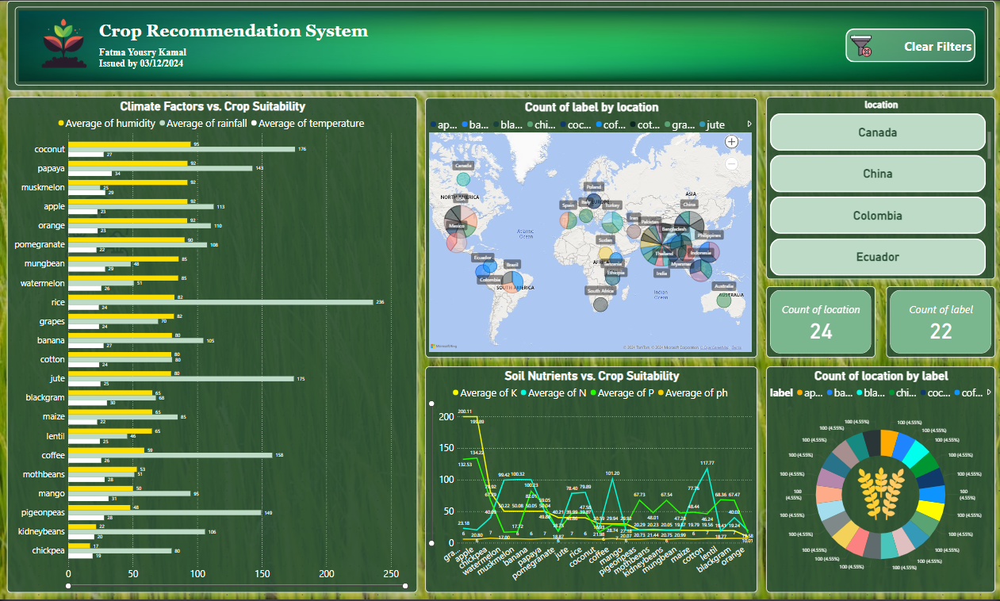
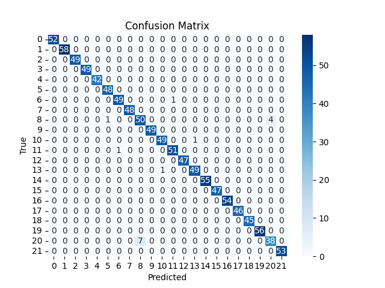

# **BigData in Crop Recommendation System**
## **Overview**  
The Crop Recommendation System is a data-driven solution designed to recommend suitable crops based on climate, soil, and location factors. This project aims to assist farmers, agricultural planners, and policymakers in maximizing crop yield and sustainability.

---

## **Features**  
- Recommends optimal crops based on soil nutrients, climate conditions, and geographical factors.  
- Visualizes data using interactive maps, charts, and graphs.  
- Implements machine learning for high-accuracy crop prediction.  
- Scalable system with MongoDB integration for efficient data handling.  

---

## **Technologies Used**  
- **Programming Languages**: Python  
- **Libraries**: Matplotlib, Seaborn, Folium, Plotly, Scikit-learn, Pandas, Numpy, Pymongo  
- **Database**: MongoDB  
- **Machine Learning**: Support Vector Machine (SVM) with One-vs-One (OvO) classification  
- **Visualization Tools**: Power BI  

---

## **Dataset**  
- **Primary Dataset**: Crop Recommendation Dataset from Kaggle  
  - **Features**: Soil nutrients (N, P, K), pH, temperature, humidity, rainfall, crop labels.  
- **Supplementary Dataset**: Crop-Location Mapping with latitude and longitude for geographical insights.  

---

## **Methodology**  
1. **Data Preprocessing**:  
   - Checked for missing values and ensured data consistency.  
   - Converted the dataset into a MongoDB-compatible format.  

2. **Feature Engineering**:  
   - Added geographical coordinates and calculated averages for climate and soil factors.  

3. **Data Visualization**:  
   - Bar charts, scatter plots, heatmaps, and interactive maps.
   - The project includes interactive visualizations created using Power BI:  

 

4. **Machine Learning**:  
   - Trained an SVM classifier with an 80-20 train-test split.  
   - Standardized numerical features for improved performance.  

5. **Model Evaluation**:  
   - Achieved an accuracy of 99% using metrics like accuracy score and confusion matrix.  
    

Here are some sample predictions made by the model:  

  
  
  
  

---

## **Key Insights**  
- Crops like rice thrive in high humidity and rainfall regions, while legumes prefer moderate conditions.  
- Geographical patterns reveal clustering of crops in specific regions (e.g., rice in Asia, coffee in South America).  
- The system provides actionable insights for optimizing crop yield.  

---

## **Challenges**  
- Integrating geographical data with the primary dataset.  
- Representing multiple factors in a single visualization.  
- Hyperparameter tuning for the SVM model.  

---

## **Future Enhancements**  
- Incorporate real-time weather data for dynamic recommendations.  
- Develop a mobile-friendly interface for ease of use by farmers.  
- Explore advanced machine learning models like Random Forests and Neural Networks.  
- Integrate GIS tools for enhanced spatial analysis.  

---
